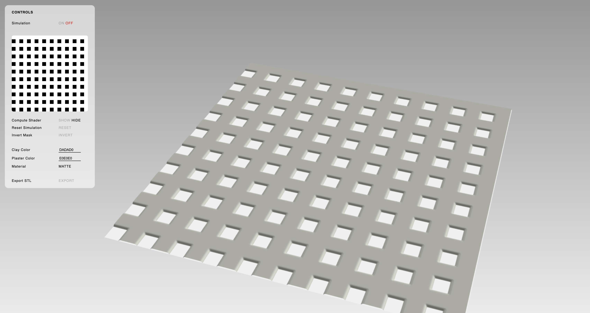
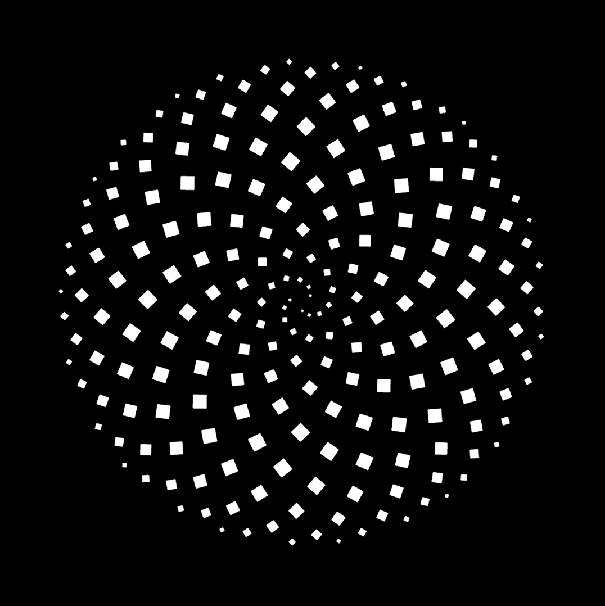
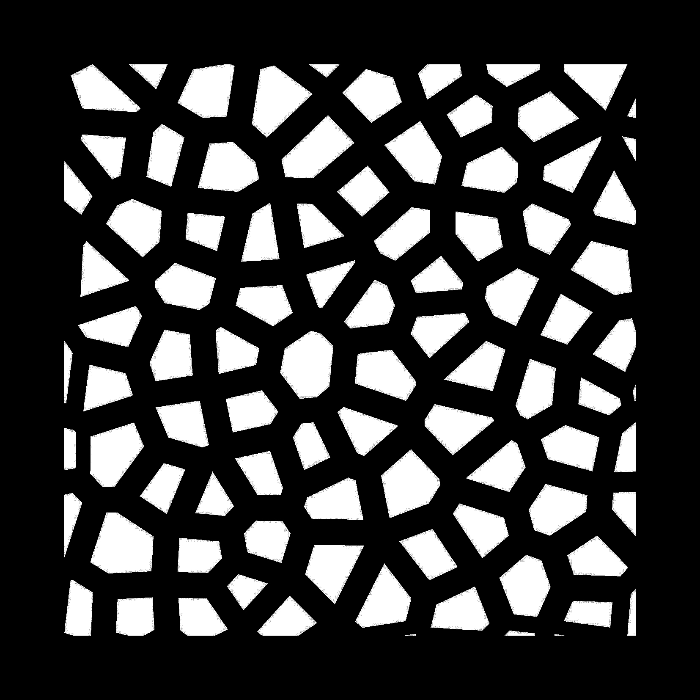

# Resist Slip-Casting Simulator

- [Simulator](https://interactive-materials.github.io/rsc-sim)
- [Project Page](https://interactivematerials.info/simulating-resist-slip-casting)
- [Publication](https://doi.org/10.1145/3800645.3812790)

## About

This is a simulator for resist slip-casting. 

Slip-casting is a craft process for making ceramic objects with a plaster mold and liquid clay ("slip"). The object is formed by clay that deposits on the walls of the the plaster mold as the mold absorbs water from slip over time. In resist slip-casting, water-resistant stickers are placed on specific regions on the mold to inhibit water absorbtion. This leads to uneven clay deposition which can be controlled to create different 2.5D textures.

Read more about resist slip-casting [here](https://interactivematerials.info/resist-slip-casting).

## Using the simulator



The software simulates resist slip-casting on a square flat plaster surface. It takes a square, grayscale image as the mask input. Black regions indicate 100% water resistance, while white regions indicate exposed plaster. Click on the mask image to upload a new mask.

Click "ON OFF" or [SPACE] to start or pause the simulation.

Click and drag on the main canvas to rotate the simulation. Scroll or pinch to zoom in and out.

⚠️ To completely overwrite an existing mask with a new mask, ensure that the input image is 100% opaque (no transparency).

Sample masks:
[](assets/mask_1.png)
[](assets/mask_2.jpg)

## Developing the simulator

This simulation deconstructs the slip casting mold volume into a 3D grid of voxels, and performs a cellular automata algorithm to calculate the rate of clay deposition on the mold surface. Each voxel looks at its neighbors and computes the movement of "clay" and "water" along the diffusion gradient. 

We made use of the THREE.js GPUComputationRenderer pipeline to perform the cellular automata calcutions. The compute shader controlling the simulation can be viewed by toggling the `Compute Shader` option in the application. The compute shader is a 2D texture image that reorganizes the 3D voxel grid into a 2D image grid.

### Compute Shader algorithm

```
uniform sampler2D u_gridState;
uniform vec2 res;
uniform int sx;
uniform int sy;
uniform int sz;

void main() {

// Compute texture coordinates from fragment position
  vec2 uv = gl_FragCoord.xy / res;
  ivec2 texSize = ivec2(res);
  ivec2 pos = ivec2(gl_FragCoord.xy);
  int idx = pos.x + texSize.x * pos.y;
  int pz = idx % sz;
  int py = (idx / sz) % sy;
  int px = idx / (sy * sz);

  if (idx >= sx * sy * sz) { // texel index is out of bounds

    gl_FragColor = vec4(0.0, 0.0, 0.0, 0.0);

  } else {

    // fetch water concentration through blue channel
    float water = texelFetch(u_gridState, ivec2(idx % texSize.x, idx / texSize.x), 0).b;

    // fetch clay concentration through red channel
    float clay = texelFetch(u_gridState, ivec2(idx % texSize.x, idx / texSize.x), 0).r;

    float waterGradient = 0.0;
    float clayAccumulation = 0.0;

    // load parameters
    float absorptionRatePlaster = ${absorptionRatePlaster};
    float absorptionRateClay = ${absorptionRateClay};
    float depositionRate = ${depositionRate};
    float depositionRateGravity = ${depositionRateGravity};
    float depositionThreshold = ${depositionThreshold};
    float depositionThresholdGravity = ${depositionThresholdGravity};
    float diffusion = ${diffusion};
    float diffusionGravity = ${diffusionGravity};
    float averaging = ${averaging};

    if (pz < sz - 1 && pz > 0) {

      // Neighbor offsets for diffusion simulation
      ivec3 neighbors[6] =
          ivec3[](ivec3(-1, 0, 0), ivec3(1, 0, 0), ivec3(0, -1, 0),
                  ivec3(0, 1, 0), ivec3(0, 0, 1), ivec3(0, 0, -1)
                  );

      for (int i = 0; i < 6; i++) {
        ivec3 npos = ivec3(px, py, pz) + neighbors[i];

        // Boundary check
        if (npos.x >= 0 && npos.x < sx && npos.y >= 0 && npos.y < sy &&
            npos.z >= 0 && npos.z < sz) {

          // Calculate the 1D index for the neighbor
          int nidx_1d = npos.z + (npos.y + npos.x * sy) * sz;

          float vWater = texelFetch(u_gridState, ivec2(nidx_1d % texSize.x, nidx_1d / texSize.x), 0).b;
          float vClay = texelFetch(u_gridState, ivec2(nidx_1d % texSize.x, nidx_1d / texSize.x), 0).r;
          float dw = 0.0;
          float dr = i >= 5 ? depositionRateGravity : depositionRate;
          float dThreshold = i >= 5 ? depositionThresholdGravity : depositionThreshold;

          if (npos.z == 0) {
            dw = absorptionRatePlaster * vWater;
            waterGradient -= dw;
            clayAccumulation += dw * dr;
          } else {
            dw = water - vWater;
            if (dw > 0.0 && clay < 1.0 && vClay >= dThreshold) {
              waterGradient += absorptionRateClay * -dw;
              clayAccumulation += dw * dr;
            } else {
              float diff = i >= 5 ? diffusionGravity : diffusion;
              waterGradient += diff * -dw;
            }
          }
        }
      }

      // Neighbor offsets for slumping simulation
      ivec3 neighbors2[8] =
          ivec3[](ivec3(-1, -1, -1), ivec3(0, -1, -1), ivec3(1, -1, -1),
                  ivec3(-1, 0, -1), ivec3(1, 0, -1),
                  ivec3(-1, 1, -1), ivec3(0, 1, -1), ivec3(1, 1, -1)
                  );

      for (int i = 0; i < 8; i++) {
        ivec3 npos = ivec3(px, py, pz) + neighbors2[i];

        // Calculate the 1D index for the neighbor
        int nidx_1d = npos.z + (npos.y + npos.x * sy) * sz;

        if (npos.z > 1) {
          // Boundary check
          if (npos.x >= 0 && npos.x < sx && npos.y >= 0 && npos.y < sy && npos.z < sz) {
            float vClay = texelFetch(u_gridState, ivec2(nidx_1d % texSize.x, nidx_1d / texSize.x), 0).r;
            float dClay = vClay - clay;
            if (dClay < 0.0) {
              clayAccumulation += averaging * dClay;
            }
          }
        }
      }


      // Neighbor offsets
      ivec3 neighbors3[8] =
          ivec3[](ivec3(-1, -1, 1), ivec3(0, -1, 1), ivec3(1, -1, 1),
                  ivec3(-1, 0, 1), ivec3(1, 0, 1),
                  ivec3(-1, 1, 1), ivec3(0, 1, 1), ivec3(1, 1, 1)
                  );

      for (int i = 0; i < 8; i++) {
        ivec3 npos = ivec3(px, py, pz) + neighbors3[i];

        // Calculate the 1D index for the neighbor
        int nidx_1d = npos.z + (npos.y + npos.x * sy) * sz;

        if (npos.z < sz - 1) {
          // Boundary check
          if (npos.x >= 0 && npos.x < sx && npos.y >= 0 && npos.y < sy && npos.z > 0) {
            float vClay = texelFetch(u_gridState, ivec2(nidx_1d % texSize.x, nidx_1d / texSize.x), 0).r;
            float dClay = vClay - clay;
            if (dClay > 0.0) {
              clayAccumulation += averaging * dClay;
            }
          }
        }
      }


      clay += clayAccumulation;
      water += waterGradient;

      clay = clamp(clay, 0.0, 1.0);
      water = clamp(water, 0.0, 1.0);
    }

    // store total height of clay deposited per column in green channel

    float totalHeight = 0.0;

    if (idx < sx * sy) {
      int sumpx = idx % sx;
      int sumpy = idx / sx;
      int sumpz = 0;
      int sumidx_1d = 0;
      for (int i = 1; i < sz; i++) {
        sumpz = i;
        sumidx_1d = sumpz + (sumpy + sumpx * sy) * sz;
        float h = texelFetch(u_gridState, ivec2(sumidx_1d % texSize.x, sumidx_1d / texSize.x), 0).r;
        totalHeight += h;
      }
    }

    if (pz == 0 || pz == sz - 1) {
      gl_FragColor = vec4(0.0, totalHeight, water, 1.0);
    } else {
      gl_FragColor = vec4(clay, totalHeight, water, 1.0);
    }
  }
}
```

